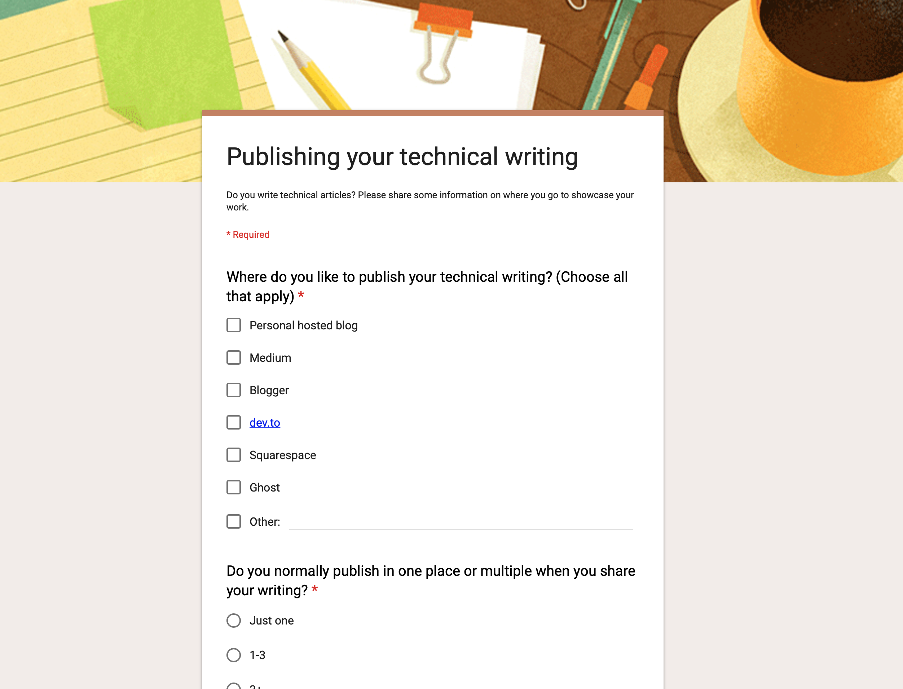
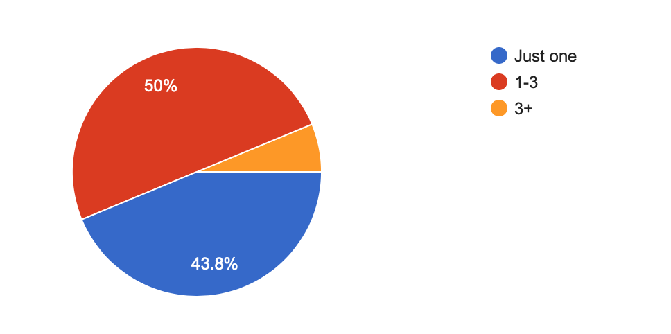
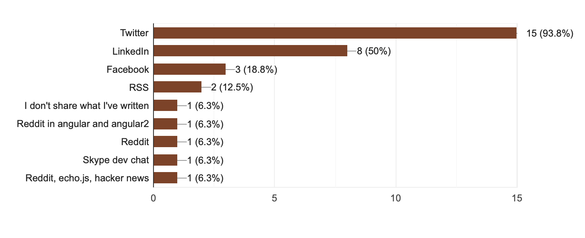

footer: May 2019 | Brenden Niedermeyer | @theNieds

# Where to Publish?

[.hide-footer]

---

# Brenden Niedermeyer

 

https://brenden.codes

^ Options, Where others publish, Strategies, Publishing experience

---

# Options

- Medium
- Dev.to
- Personal Blog
- Wordpress
- Etc...

^ Hashnode, Reddit, Ghost...

---

[.hide-footer]

^"I know where I publish, where do others?"

---

[.hide-footer]

^Only 16 responses
Small sample size, but still provided some insights

---

# Where?

- 75% - Medium
- 62.5% - personal blog
- 31% - dev.to
- 1% - Wordpress, Hashnode

---

# How many places do you post?

^ My workflow: post on brenden.codes then crosspost to medium and dev.to

---

# How do you spread the word of your writing?

---

> "The publication that I contribute to is on that platform. Hopefully move onto a better one soon."

---

# Pain Points

---

# Pain Points

- Code blocks/syntax highlighting
- Handling edits
- Not simple to crosspost

---

# What are some reasons you would not choose to publish to a specific platform?

- Paywalls (56%)
- Copyright/Licensing Concerns (50%)
- Lack of user base (43.8%)

---

# Resources

- Slides: [https://github.com/bniedermeyer/publishing-tech-writing-ng-conf](https://github.com/bniedermeyer/publishing-tech-writing-ng-conf)
- Survey: https://brenden.dev/survey

